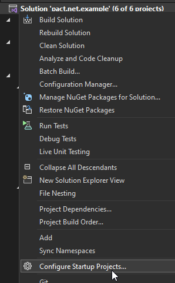

# Pact.NET Example

Solution contains:

- A products API as the producer
- A consumer (consumer1), using GET /products
- A consumer (consumer2), using GET /products/{id}

Examples heavily based on blog <https://www.c-sharpcorner.com/article/consumer-driven-contract-testing-using-pactnet>.

Provider uses `Controllers` due to PACT not being able to access the In Memory Test Server instance.  To spin up the provider using `IHost` a `Startup` is required.  Consumers use the minimal API structure.

## Running Locally

To manually test the APIs, ensure all three projects are set to startup.  Provider port must match that in `appsettings.json`.



## Running PACT Tests

PACTs are produced when the Consumer(s) tests execute, pacts are automatically placed in 'pacts' at the root of the repository.

The provider is hard coded to download PACTs from this directory.

## Integration Tests

Solution contains examples of integration testing using the in-memory test server.

- Consumer1 - Mocks the entire Provider Service
- Consumer2 - Mocks the HTTP Client Handler

## Project Setup

Creating solution:

```CMD
dotnet new sln --name pact.net.example
```

Creating consumer:

```CMD
dotnet new webapi -minimal -o consumer<x>

dotnet sln add source\consumer<x>\consumer<x>.csproj
```

Creating provider:

```CMD
dotnet new webapi -controllers -o provider

dotnet sln add source\provider\provider.csproj
```

## To Do

1. producer needs to be renamed to provider.
1. Add in memory integration tests to provider
1. FIX: unable to add readme to solution
